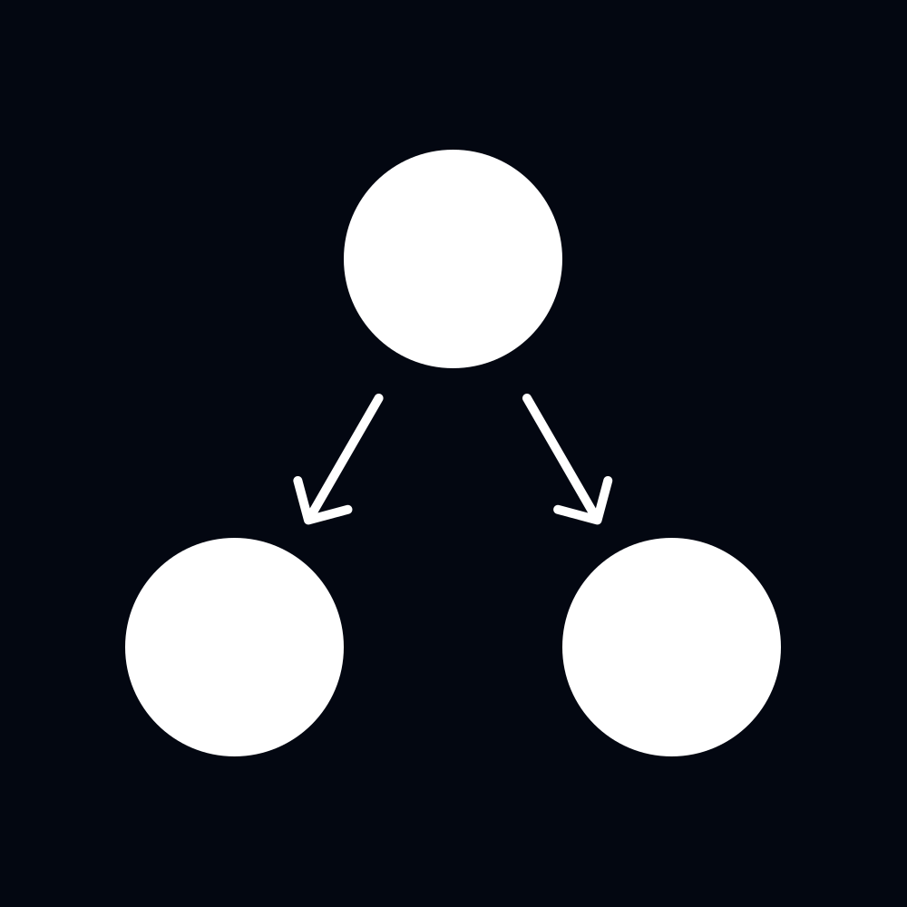

<div align="center">
  
  <h1>LaraGraph</h1>
  <p>Stateful, graph-based workflow engine for Laravel.<br>Build multi-step agent pipelines, human-in-the-loop processes, and parallel fan-out/fan-in tasks — all backed by your database and queue.</p>

  [](https://packagist.org/packages/cainydev/laragraph)
  [](https://github.com/cainydev/laragraph/actions?query=workflow%3Arun-tests+branch%3Amain)
  [](https://packagist.org/packages/cainydev/laragraph)

  <sub>Inspired by <a href="https://github.com/langchain-ai/langgraph">LangGraph</a></sub>
</div>

---

---

## Table of Contents

- [Installation](#installation)
- [Core Concepts](#core-concepts)
- [Building a Workflow](#building-a-workflow)
  - [Nodes](#nodes)
  - [Transitions](#transitions)
  - [Conditional Edges](#conditional-edges)
  - [Branch Edges](#branch-edges)
  - [Fan-out / Fan-in](#fan-out--fan-in)
- [Running a Workflow](#running-a-workflow)
  - [Registering Workflows](#registering-workflows)
  - [Starting a Run](#starting-a-run)
  - [Starting from a Blueprint](#starting-from-a-blueprint)
- [State](#state)
  - [Reducers](#reducers)
  - [Custom Reducer](#custom-reducer)
- [Human-in-the-Loop](#human-in-the-loop)
  - [interrupt_before](#interrupt_before)
  - [interrupt_after](#interrupt_after)
  - [Resuming](#resuming)
  - [Dynamic Pause from a Node](#dynamic-pause-from-a-node)
- [Node Contracts](#node-contracts)
  - [HasName](#hasname)
  - [HasTags](#hastags)
  - [HasTimeout](#hastimeout)
  - [HasRetryPolicy](#hasretrypolicy)
- [Built-in Node Types](#built-in-node-types)
  - [AgentNode](#agentnode)
  - [ToolNode](#toolnode)
  - [FormatNode](#formatnode)
  - [HumanInterruptNode](#humaninterruptnode)
- [Sub-graph Workflows](#sub-graph-workflows)
- [Events](#events)
- [Configuration](#configuration)
- [Testing](#testing)

---

## Installation

```bash
composer require cainy/laragraph
```

Publish and run the migration:

```bash
php artisan vendor:publish --tag="laragraph-migrations"
php artisan migrate
```

Publish the config file:

```bash
php artisan vendor:publish --tag="laragraph-config"
```

---

## Core Concepts

LaraGraph models a workflow as a **directed graph** of nodes connected by edges. Each run of that graph is a `WorkflowRun` — a database record that tracks the current state, status, and active node pointers.

| Term | Meaning |
|---|---|
| **Node** | A unit of work. Receives the current state, returns a mutation. |
| **Edge** | A directed connection between two nodes, optionally conditional. |
| **State** | A plain PHP array that accumulates mutations as nodes execute. |
| **Pointer** | Tracks which nodes are currently in-flight for a run. |
| **WorkflowRun** | The persisted record for a single execution of a workflow. |

Execution is fully queue-driven. Each node runs as an independent `ExecuteNode` job, so parallel branches execute concurrently across your worker pool.

---

## Building a Workflow

### Nodes

A node is any class implementing `Cainy\Laragraph\Contracts\Node`:

```php
use Cainy\Laragraph\Contracts\Node;
use Cainy\Laragraph\Engine\NodeExecutionContext;

class SummarizeNode implements Node
{
    public function handle(NodeExecutionContext $context, array $state): array
    {
        $text = implode("\n", $state['paragraphs'] ?? []);

        return ['summary' => substr($text, 0, 200)];
    }
}
```

`handle()` receives a typed `NodeExecutionContext` and the current full state. It returns an array of **mutations** — only the keys you want to change.

#### NodeExecutionContext

The context object carries everything the node needs to know about its execution environment:

```php
$context->runId          // int   — ID of the WorkflowRun
$context->workflowKey    // string — registered name or key of the workflow
$context->nodeName       // string — name of this node in the graph
$context->attempt        // int   — current queue attempt (1-based)
$context->maxAttempts    // int   — maximum attempts configured
$context->createdAt      // DateTimeImmutable
$context->isolatedPayload // ?array — payload from a Send fan-out (see below)
```

### Transitions

Build a workflow with the fluent `Workflow` builder:

```php
use Cainy\Laragraph\Builder\Workflow;

$workflow = Workflow::create()
    ->addNode('fetch',     FetchNode::class)
    ->addNode('transform', TransformNode::class)
    ->addNode('store',     StoreNode::class)
    ->transition(Workflow::START, 'fetch')
    ->transition('fetch',     'transform')
    ->transition('transform', 'store')
    ->transition('store',     Workflow::END);
```

`Workflow::START` and `Workflow::END` are the reserved entry and exit pseudo-nodes.

Nodes can be registered as class strings (resolved via the container) or as pre-built instances.

### Conditional Edges

Pass a condition as the third argument to `->transition()`. It can be a **Closure** or a **Symfony Expression Language string**:

```php
// Closure
->transition('classify', 'approve', fn(array $state) => $state['score'] > 50)
->transition('classify', 'reject',  fn(array $state) => $state['score'] <= 50)

// Expression string (serializable — required for snapshot workflows)
->transition('classify', 'approve', "state['score'] > 50")
->transition('classify', 'reject',  "state['score'] <= 50")
```

The expression receives the full state under the `state` variable.

**Built-in expression functions:**

| Function | Description |
|---|---|
| `has_tool_calls(messages)` | Returns `true` if the last message in `messages` contains `tool_calls`. |
| `send_all(nodeName, items, key)` | Returns a `Send[]` array for dynamic fan-out (see below). |

### Branch Edges

A `branch` edge uses a resolver to return one or more target node names dynamically at runtime:

```php
->branch('router', function(array $state): string {
    return $state['approved'] ? 'publish' : 'revise';
}, targets: ['publish', 'revise'])
```

The `targets` array is optional but recommended — it enables graph visualization without executing the resolver.

For serializable workflows, pass an expression string as the resolver:

```php
->branch('router', "state['approved'] ? 'publish' : 'revise'", targets: ['publish', 'revise'])
```

### Fan-out / Fan-in

To execute multiple nodes in parallel from a single node, add multiple transitions from the same source:

```php
Workflow::create()
    ->addNode('split',    SplitNode::class)
    ->addNode('branch-a', BranchANode::class)
    ->addNode('branch-b', BranchBNode::class)
    ->addNode('merge',    MergeNode::class)
    ->transition(Workflow::START, 'split')
    ->transition('split', 'branch-a')   // dispatched in parallel
    ->transition('split', 'branch-b')   // dispatched in parallel
    ->transition('branch-a', 'merge')
    ->transition('branch-b', 'merge')
    ->transition('merge', Workflow::END);
```

`branch-a` and `branch-b` run as independent queue jobs. The `merge` node is dispatched once each branch completes. Fan-in barrier logic (waiting for all branches) is the node's responsibility — check that all expected state keys are present before proceeding.

#### Dynamic Fan-out with `Send`

To fan out over a dynamic list, return `Send` objects from a branch edge:

```php
use Cainy\Laragraph\Routing\Send;

// In a branch edge resolver:
->branch('planner', function(array $state): array {
    return array_map(
        fn(string $query) => new Send('worker', ['query' => $query]),
        $state['queries']
    );
}, targets: ['worker'])
```

Each `Send` dispatches an independent `ExecuteNode` job with an `isolatedPayload` available via `$context->isolatedPayload`.

---

## Running a Workflow

### Registering Workflows

Register workflows in your `AppServiceProvider` or a dedicated provider:

```php
use Cainy\Laragraph\Facades\Laragraph;

public function boot(): void
{
    Laragraph::register('my-pipeline', fn() => MyPipelineWorkflow::build());
}
```

Or register them via the config file:

```php
// config/laragraph.php
'workflows' => [
    'my-pipeline' => MyPipelineWorkflow::class, // must return a Workflow or CompiledWorkflow
],
```

### Starting a Run

```php
use Cainy\Laragraph\Facades\Laragraph;

$run = Laragraph::start('my-pipeline', initialState: [
    'input' => 'Hello, world!',
]);

echo $run->id;     // WorkflowRun ID
echo $run->status; // RunStatus::Running
```

The run is created synchronously. Node jobs are dispatched to your queue immediately after.

### Starting from a Blueprint

For ad-hoc workflows that aren't pre-registered, pass a `Workflow` builder directly. The graph is serialized as a snapshot so workers can reconstruct it without a registry:

```php
$run = Laragraph::startFromBlueprint(
    blueprint: Workflow::create()
        ->withName('ad-hoc-pipeline')
        ->addNode('step', MyNode::class)
        ->transition(Workflow::START, 'step')
        ->transition('step', Workflow::END),
    initialState: ['input' => 'data'],
);
```

> Snapshot workflows require all edges to use expression strings (not Closures), since Closures cannot be serialized.

### Controlling a Run

```php
// Pause a running workflow
Laragraph::pause($run->id);

// Resume a paused workflow, optionally merging additional state
Laragraph::resume($run->id, ['approved' => true]);

// Abort a workflow (sets status to Failed, clears pointers)
Laragraph::abort($run->id);
```

These are also available as model methods:

```php
$run->pause();
$run->resume(['approved' => true]);
$run->abort();
```

---

## State

State is a plain PHP array that persists in the `workflow_runs.state` column. Every node receives the full current state and returns a **mutation** — a partial array of keys to update.

The **reducer** determines how mutations are merged into the existing state.

### Reducers

LaraGraph ships with three reducers:

| Class | Behaviour |
|---|---|
| `SmartReducer` *(default)* | List arrays are **appended**. Scalars and associative arrays are **overwritten**. |
| `MergeReducer` | Deep recursive merge for all keys. |
| `OverwriteReducer` | Shallow `array_merge` — always overwrites. |

`SmartReducer` is the right default for most agent workflows: message histories accumulate naturally, while scalar values like `status` or `score` simply overwrite.

### Custom Reducer

Implement `StateReducerInterface` and bind it in your service provider, or attach it to a specific workflow:

```php
// Globally
$this->app->bind(StateReducerInterface::class, MyReducer::class);

// Per workflow
Workflow::create()
    ->withReducer(MyReducer::class)
    // ...
```

---

## Human-in-the-Loop

LaraGraph has first-class support for pausing workflows and waiting for human input before continuing.

### interrupt_before

Pause the run **before** a node executes. On resume, the node runs normally.

```php
Workflow::create()
    ->addNode('review', ReviewNode::class)
    // ...
    ->interruptBefore('review');
```

### interrupt_after

Pause the run **after** a node executes but before its outgoing edges are evaluated. Use this when you want a human to inspect the node's output before the workflow continues.

```php
Workflow::create()
    ->addNode('drafter', DrafterNode::class)
    ->addNode('publish',  PublishNode::class)
    ->transition(Workflow::START, 'drafter')
    ->transition('drafter', 'publish')
    ->transition('publish', Workflow::END)
    ->interruptAfter('drafter'); // pauses after draft is written
```

### Resuming

Call `Laragraph::resume()` with any additional state to merge before the run continues. This is how you pass human decisions back into the workflow:

```php
// Human approves — merge the decision into state, edges evaluate against it
Laragraph::resume($run->id, [
    'meta' => ['approved' => true],
]);
```

A branch edge on the next node can then route based on `state['meta']['approved']`.

### Dynamic Pause from a Node

Any node can pause the run at runtime by throwing `NodePausedException`. Unlike `interrupt_before/after`, this lets the node itself decide whether to pause based on runtime state:

```php
use Cainy\Laragraph\Exceptions\NodePausedException;

class ConfidenceCheckNode implements Node
{
    public function handle(NodeExecutionContext $context, array $state): array
    {
        if ($state['confidence'] < 0.7) {
            throw new NodePausedException($context->nodeName);
        }

        return ['status' => 'confident'];
    }
}
```

The engine keeps the node's active pointer alive so `resume()` re-dispatches it from the same position.

---

## Node Contracts

Nodes can implement optional contracts to declare capabilities to the engine.

### HasName

Give a node a human-readable identifier for graph visualization and edge routing:

```php
use Cainy\Laragraph\Contracts\HasName;

class ResearchAgentNode implements Node, HasName
{
    public function name(): string
    {
        return 'research-agent';
    }

    // ...
}
```

### HasTags

Emit telemetry metadata alongside the `NodeCompleted` event. Useful for tracking token usage, model names, cost centers, or tenant IDs:

```php
use Cainy\Laragraph\Contracts\HasTags;

class LLMNode implements Node, HasTags
{
    public function tags(): array
    {
        return [
            'model'       => 'claude-sonnet-4-6',
            'cost_center' => 'marketing',
        ];
    }

    // ...
}
```

Tags are included in the `NodeCompleted` event payload and broadcast to the workflow channel.

### HasTimeout

Declare a maximum execution time in seconds. If the node exceeds this limit, the queue worker terminates the job and the retry policy kicks in:

```php
use Cainy\Laragraph\Contracts\HasTimeout;

class SlowAPINode implements Node, HasTimeout
{
    public function timeout(): int
    {
        return 120; // 2 minutes
    }

    // ...
}
```

### HasRetryPolicy

Define per-node retry behaviour with exponential backoff and optional jitter:

```php
use Cainy\Laragraph\Contracts\HasRetryPolicy;
use Cainy\Laragraph\Engine\RetryPolicy;

class FlakyAPINode implements Node, HasRetryPolicy
{
    public function retryPolicy(): RetryPolicy
    {
        return new RetryPolicy(
            initialInterval: 1.0,   // seconds before first retry
            backoffFactor:   2.0,   // doubles each attempt
            maxInterval:     30.0,  // cap at 30 seconds
            maxAttempts:     5,
            jitter:          true,  // add ±25% randomness
        );
    }

    // ...
}
```

You can also restrict retries to specific exception types:

```php
new RetryPolicy(
    maxAttempts: 3,
    retryOn: [RateLimitException::class, TimeoutException::class],
)

// Or with a Closure for full control:
new RetryPolicy(
    maxAttempts: 3,
    retryOn: fn(Throwable $e) => $e->getCode() === 429,
)
```

The current attempt number is always available in the node via `$context->attempt` and `$context->maxAttempts`.

---

## Built-in Node Types

### AgentNode

Abstract base for Prism-powered LLM nodes. Override `getPrompt()` and optionally `tools()`:

```php
use Cainy\Laragraph\Nodes\AgentNode;
use Prism\Prism\Enums\Provider;

class SummarizeAgent extends AgentNode
{
    protected Provider|string $provider = Provider::Anthropic;
    protected string $model = 'claude-sonnet-4-6';
    protected string $systemPrompt = 'You are a concise summarizer.';

    protected function getPrompt(array $state): string
    {
        return 'Summarize: ' . $state['text'];
    }
}
```

`AgentNode::handle()` calls Prism, appends the assistant message to `state['messages']`, and includes any tool calls in the message.

### ToolNode

Abstract base for nodes that execute tool calls from the last message in `state['messages']`. Implement `toolMap()` to return a map of tool names to callables:

```php
use Cainy\Laragraph\Nodes\ToolNode;

class WeatherToolNode extends ToolNode
{
    protected function toolMap(): array
    {
        return [
            'get_weather' => fn(array $args): string =>
                "Sunny, 22°C in " . ($args['city'] ?? 'unknown'),

            'get_forecast' => fn(array $args): string =>
                ForecastService::get($args['city'], $args['days'] ?? 3),
        ];
    }
}
```

Tool results are appended to `state['messages']` as `role: tool` messages, ready for the next `AgentNode` in the cycle.

### FormatNode

A lightweight inline node for pure state transforms — no class required:

```php
use Cainy\Laragraph\Nodes\FormatNode;

Workflow::create()
    ->addNode('format', new FormatNode(
        fn(array $state) => ['summary' => implode("\n", $state['lines'])]
    ))
```

The closure receives `($state, ?array $isolatedPayload)` and returns a mutation array.

### HumanInterruptNode

A convenience node that always pauses the run and fires a `HumanInterventionRequired` event. Prefer `->interruptBefore()` / `->interruptAfter()` for static pause points — use this when the pause decision is dynamic:

```php
Workflow::create()
    ->addNode('check', new HumanInterruptNode())
```

---

## Sub-graph Workflows

Any `CompiledWorkflow` implements `Node` and can be embedded directly inside another workflow. This lets you compose complex pipelines from smaller, independently testable pieces.

```php
$researchSubgraph = Workflow::create()
    ->withName('research')
    ->addNode('search',  SearchNode::class)
    ->addNode('extract', ExtractNode::class)
    ->transition(Workflow::START, 'search')
    ->transition('search',  'extract')
    ->transition('extract', Workflow::END)
    ->compile();

$parentWorkflow = Workflow::create()
    ->addNode('research', $researchSubgraph)  // compiled workflow as a node
    ->addNode('write',    WriteNode::class)
    ->transition(Workflow::START, 'research')
    ->transition('research', 'write')
    ->transition('write', Workflow::END);
```

### How it works

When the engine executes a `CompiledWorkflow` node:

1. A child `WorkflowRun` is created and linked to the parent via `parent_run_id` and `parent_node_name`.
2. The child workflow starts normally — its nodes run as independent queue jobs.
3. The parent run **pauses** at the sub-graph node, keeping its pointer alive.
4. When the child completes, the engine resumes the parent automatically.
5. The parent node re-executes, reads the child's final state, computes the delta, and returns it as a mutation.

The parent and child appear as separate entries in `workflow_runs`, making it easy to inspect each level of a complex pipeline independently. Each node in the sub-graph gets its own retries, timeout, and telemetry.

### Parent-child relations

```php
$run = WorkflowRun::find($id);

$run->parent;    // ?WorkflowRun — the parent run, if this is a child
$run->children;  // Collection<WorkflowRun> — all child runs spawned by this run
```

---

## Events

LaraGraph fires events throughout the workflow lifecycle. All events implement `ShouldBroadcast` and are broadcast on the workflow channel when broadcasting is enabled.

| Event | Payload |
|---|---|
| `WorkflowStarted` | `runId`, `workflowKey` |
| `NodeExecuting` | `runId`, `nodeName` |
| `NodeCompleted` | `runId`, `nodeName`, `mutation`, `tags` |
| `NodeFailed` | `runId`, `nodeName`, `exception` |
| `WorkflowCompleted` | `runId` |
| `WorkflowFailed` | `runId`, `exception` |
| `WorkflowResumed` | `runId` |
| `HumanInterventionRequired` | `runId` |

### Broadcasting

Enable broadcasting in your `.env`:

```env
LARAGRAPH_BROADCASTING_ENABLED=true
LARAGRAPH_CHANNEL_TYPE=private       # public | private | presence
LARAGRAPH_CHANNEL_PREFIX=workflow.
```

Each run broadcasts on channel `{prefix}{runId}` (e.g. `workflow.42`). Authorize the channel in your `routes/channels.php` as needed.

---

## Configuration

```php
// config/laragraph.php
return [
    // Queue name for ExecuteNode jobs
    'queue' => env('LARAGRAPH_QUEUE', 'default'),

    // Queue connection (null = default connection)
    'connection' => env('LARAGRAPH_QUEUE_CONNECTION'),

    // Default max attempts per node (overridden per-node via HasRetryPolicy)
    'max_node_attempts' => 3,

    // Default node timeout in seconds (overridden per-node via HasTimeout)
    'node_timeout' => 60,

    // DB lock timeout in seconds
    'lock_timeout' => 30,

    // Soft-delete workflow runs older than this many days
    'prunable_after_days' => 30,

    // Pre-registered workflows (name => class or callable)
    'workflows' => [],

    'broadcasting' => [
        'enabled'        => env('LARAGRAPH_BROADCASTING_ENABLED', false),
        'channel_type'   => env('LARAGRAPH_CHANNEL_TYPE', 'private'),
        'channel_prefix' => env('LARAGRAPH_CHANNEL_PREFIX', 'workflow.'),
    ],
];
```

---

## Testing

```bash
composer test
```

LaraGraph is designed to work with the `sync` queue driver in tests — set `QUEUE_CONNECTION=sync` in your `phpunit.xml` or test environment and runs will execute synchronously, making assertions straightforward:

```php
use Cainy\Laragraph\Facades\Laragraph;
use Cainy\Laragraph\Enums\RunStatus;

it('completes the pipeline', function () {
    $run = Laragraph::start('my-pipeline', ['input' => 'hello']);

    expect($run->fresh())
        ->status->toBe(RunStatus::Completed)
        ->state->toHaveKey('output');
});
```

For unit-testing individual nodes, use the `makeContext()` test helper:

```php
use function Cainy\Laragraph\Tests\makeContext;

it('returns a summary mutation', function () {
    $node = new SummarizeNode();

    $mutation = $node->handle(
        makeContext(nodeName: 'summarize'),
        ['text' => 'Long article...'],
    );

    expect($mutation)->toHaveKey('summary');
});
```

---

## License

The MIT License (MIT). Please see [License File](LICENSE.md) for more information.
