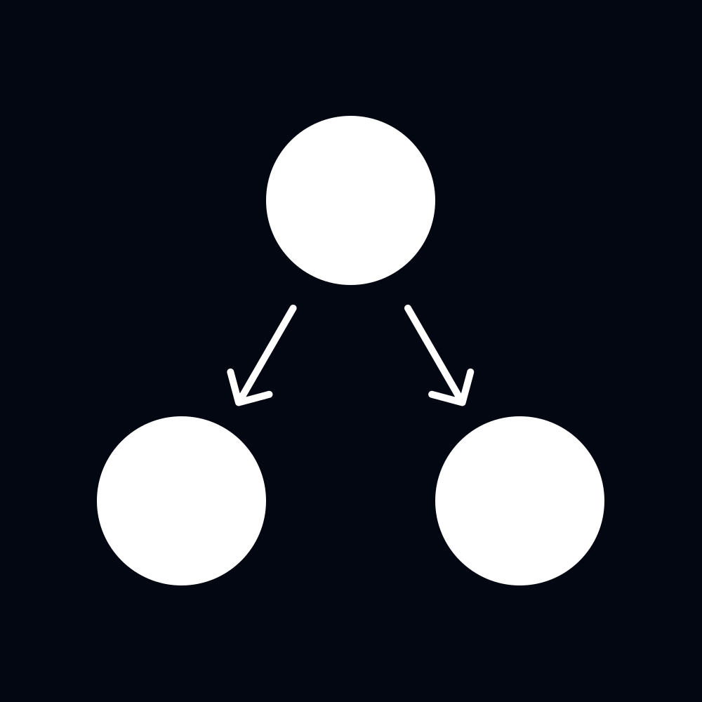

<div align="left">
  
  <h1>LaraGraph</h1>

  [](https://packagist.org/packages/cainydev/laragraph)
  [](https://github.com/cainydev/laragraph/actions?query=workflow%3Arun-tests+branch%3Amain)
  [](https://packagist.org/packages/cainydev/laragraph)

  <p>Stateful, graph-based workflow engine for Laravel.<br>Build multi-step agent pipelines, human-in-the-loop processes, and parallel fan-out/fan-in tasks — all backed by your database and queue.</p>

  <sub>Inspired by <a href="https://github.com/langchain-ai/langgraph">LangGraph</a></sub>
</div>

## Table of Contents

- [Installation](#installation)
- [Core Concepts](#core-concepts)
- [Building a Workflow](#building-a-workflow)
  - [Nodes](#nodes)
  - [Transitions](#transitions)
  - [Conditional Edges](#conditional-edges)
  - [Branch Edges](#branch-edges)
  - [Parallel Branches](#parallel-branches)
  - [Dynamic Fan-out with Send](#dynamic-fan-out-with-send)
- [Running a Workflow](#running-a-workflow)
  - [Starting a Run](#starting-a-run)
  - [Controlling a Run](#controlling-a-run)
  - [Lifecycle Hooks](#lifecycle-hooks)
- [State](#state)
  - [Reducers](#reducers)
  - [Custom Reducer](#custom-reducer)
- [Human-in-the-Loop](#human-in-the-loop)
  - [interrupt_before](#interrupt_before)
  - [interrupt_after](#interrupt_after)
  - [Resuming](#resuming)
  - [Dynamic Pause from a Node](#dynamic-pause-from-a-node)
- [Node Contracts](#node-contracts)
  - [HasName](#hasname)
  - [HasTags](#hastags)
  - [HasRetryPolicy](#hasretrypolicy)
  - [HasQueue](#hasqueue)
  - [HasMiddleware](#hasmiddleware)
  - [HasLoop](#hasloop)
  - [IsFanInBarrier](#isfaninbarrier)
- [Built-in Nodes](#built-in-nodes)
  - [GateNode](#gatenode)
  - [SendNode](#sendnode)
  - [ReduceNode](#reducenode)
  - [HttpNode](#httpnode)
  - [DelayNode](#delaynode)
  - [CacheNode](#cachenode)
  - [NotifyNode](#notifynode)
- [Prism Integration](#prism-integration)
  - [PrismNode](#prismnode)
  - [ToolNode](#toolnode)
  - [Automatic Tool Loops](#automatic-tool-loops)
  - [Manual Tool Routing](#manual-tool-routing)
- [Laravel AI Integration](#laravel-ai-integration)
  - [AsGraphNode Trait](#asgraphnode-trait)
  - [Structured Output](#structured-output)
  - [Tool-Using Agents](#tool-using-agents)
- [Sub-graph Workflows](#sub-graph-workflows)
- [Recursion Limit](#recursion-limit)
- [Events](#events)
- [Configuration](#configuration)
- [Testing](#testing)

---

## Installation

```bash
composer require cainy/laragraph
```

Publish and run the migration:

```bash
php artisan vendor:publish --tag="laragraph-migrations"
php artisan migrate
```

Publish the config file:

```bash
php artisan vendor:publish --tag="laragraph-config"
```

---

## Core Concepts

LaraGraph models a workflow as a **directed graph** of nodes connected by edges. Each run of that graph is a `WorkflowRun` — a database record that tracks the current state, status, and active node pointers.

| Term | Meaning |
|---|---|
| **Node** | A unit of work. Receives the current state, returns a mutation. |
| **Edge** | A directed connection between two nodes, optionally conditional. |
| **State** | A plain PHP array that accumulates mutations as nodes execute. |
| **Pointer** | Tracks which nodes are currently in-flight for a run. |
| **WorkflowRun** | The persisted record for a single execution of a workflow. |

Execution is fully queue-driven. Each node runs as an independent `ExecuteNode` job, so parallel branches execute concurrently across your worker pool.

---

## Building a Workflow

Workflows are classes that extend `Workflow` and define their graph in a `definition()` method:

```php
use Cainy\Laragraph\Builder\Workflow;

class MyPipeline extends Workflow
{
    public function definition(): void
    {
        $this->addNode('fetch',     FetchNode::class)
             ->addNode('transform', TransformNode::class)
             ->addNode('store',     StoreNode::class)
             ->transition(Workflow::START, 'fetch')
             ->transition('fetch',     'transform')
             ->transition('transform', 'store')
             ->transition('store',     Workflow::END);
    }
}
```

You can also call `compile()` directly on a `Workflow` instance if you prefer building inline, but the class-based approach is recommended since workflows are stored by class name.

### Nodes

A node is any class implementing `Cainy\Laragraph\Contracts\Node`:

```php
use Cainy\Laragraph\Contracts\Node;
use Cainy\Laragraph\Engine\NodeExecutionContext;

class SummarizeNode implements Node
{
    public function handle(NodeExecutionContext $context, array $state): array
    {
        $text = implode("\n", $state['paragraphs'] ?? []);

        return ['summary' => substr($text, 0, 200)];
    }
}
```

`handle()` receives a typed `NodeExecutionContext` and the current full state. It returns an array of **mutations** — only the keys you want to change.

#### NodeExecutionContext

```php
$context->runId           // int    — ID of the WorkflowRun
$context->workflowKey     // string — class name of the workflow
$context->nodeName        // string — name of this node in the graph
$context->attempt         // int    — current queue attempt (1-based)
$context->maxAttempts     // int    — maximum attempts configured
$context->createdAt       // DateTimeImmutable
$context->isolatedPayload // ?array — payload injected by a Send (see Dynamic Fan-out)

// Helpers for Send-dispatched nodes:
$context->isSendExecution()        // bool   — true when dispatched via a Send
$context->payload('key', $default) // mixed  — read a value from the isolated payload
```

### Transitions

```php
$this->transition(Workflow::START, 'fetch')
     ->transition('fetch', 'transform')
     ->transition('transform', Workflow::END);
```

`Workflow::START` and `Workflow::END` are reserved entry and exit pseudo-nodes.

Nodes can be registered as class strings (resolved via the container) or as pre-built instances.

### Conditional Edges

Pass a Closure as the third argument to `->transition()`:

```php
->transition('classify', 'approve', fn(array $state) => $state['score'] > 50)
->transition('classify', 'reject',  fn(array $state) => $state['score'] <= 50)
```

### Branch Edges

A `branch` edge uses a resolver to return one or more target node names dynamically at runtime:

```php
->branch('router', function(array $state): string {
    return $state['approved'] ? 'publish' : 'revise';
}, targets: ['publish', 'revise'])
```

The `targets` array is optional but recommended — it enables graph visualization without executing the resolver.

### Parallel Branches

To execute multiple nodes in parallel from a single node, add multiple transitions from the same source:

```php
$this->addNode('split',    SplitNode::class)
     ->addNode('branch-a', BranchANode::class)
     ->addNode('branch-b', BranchBNode::class)
     ->addNode('merge',    MergeNode::class)
     ->transition(Workflow::START, 'split')
     ->transition('split', 'branch-a')
     ->transition('split', 'branch-b')
     ->transition('branch-a', 'merge')
     ->transition('branch-b', 'merge')
     ->transition('merge', Workflow::END);
```

`branch-a` and `branch-b` run as independent queue jobs. Fan-in barrier logic can be handled with the built-in `ReduceNode` or in your own node by inspecting state.

### Dynamic Fan-out with Send

To fan out over a dynamic list, return `Send` objects from a branch edge resolver:

```php
use Cainy\Laragraph\Routing\Send;

->branch('planner', function(array $state): array {
    return array_map(
        fn(string $query) => new Send('worker', ['query' => $query]),
        $state['queries']
    );
}, targets: ['worker'])
```

Each `Send` dispatches an independent `ExecuteNode` job. The target node receives the payload via `$context->isolatedPayload` or the helper methods:

```php
public function handle(NodeExecutionContext $context, array $state): array
{
    $query = $context->payload('query');
    // ...
}
```

The same fan-out is available via the `SendNode` prebuilt (see [Built-in Nodes](#built-in-nodes)).

---

## Running a Workflow

### Starting a Run

```php
use Cainy\Laragraph\Facades\Laragraph;

$run = Laragraph::run(MyPipeline::class, initialState: [
    'input' => 'Hello, world!',
]);

echo $run->id;     // WorkflowRun ID
echo $run->status; // RunStatus::Running
```

Pass an optional `metadata` array as the third argument to attach correlation data that travels with the run without being visible to nodes:

```php
$run = Laragraph::run(MyPipeline::class,
    initialState: ['input' => 'Hello'],
    metadata: ['trace_id' => $traceId, 'user_id' => $userId],
);

$run->metadata; // ['trace_id' => ..., 'user_id' => ...]
```

The run is created synchronously. Node jobs are dispatched to your queue immediately after.

### Controlling a Run

```php
// Pause a running workflow
Laragraph::pause($run->id);

// Resume a paused workflow, optionally merging additional state
Laragraph::resume($run->id, ['approved' => true]);

// Abort a workflow (sets status to Failed, clears all pointers)
Laragraph::abort($run->id);
```

### Lifecycle Hooks

Override any of these methods on your `Workflow` subclass to react to run lifecycle events. Hook exceptions are swallowed and never affect engine state.

```php
class MyPipeline extends Workflow
{
    public function definition(): void { /* ... */ }

    public function onStarting(WorkflowRun $run): void
    {
        Log::info("Run {$run->id} starting");
    }

    public function onCompleted(WorkflowRun $run): void
    {
        Cache::forget("pipeline:{$run->metadata['trace_id']}");
    }

    public function onFailed(WorkflowRun $run, Throwable $exception): void
    {
        report($exception);
    }
}
```

---

## State

State is a plain PHP array that persists in the `workflow_runs.state` column. Every node receives the full current state and returns a **mutation** — a partial array of keys to update.

The **reducer** determines how mutations are merged into the existing state.

### Reducers

LaraGraph ships with three reducers:

| Class | Behaviour |
|---|---|
| `SmartReducer` *(default)* | List arrays are **appended**. Scalars and associative arrays are **overwritten**. |
| `MergeReducer` | Deep recursive merge for all keys. |
| `OverwriteReducer` | Shallow `array_merge` — always overwrites. |

`SmartReducer` is the right default for most agent workflows: message histories accumulate naturally, while scalar values like `status` or `score` simply overwrite.

### Custom Reducer

Implement `StateReducerInterface` and bind it in your service provider, or attach it to a specific workflow:

```php
// Globally
$this->app->bind(StateReducerInterface::class, MyReducer::class);

// Per workflow
$this->withReducer(MyReducer::class)
```

---

## Human-in-the-Loop

LaraGraph has first-class support for pausing workflows and waiting for human input.

### interrupt_before

Pause the run **before** a node executes. On resume, the node runs normally.

```php
$this->addNode('review', ReviewNode::class)
     ->interruptBefore('review');
```

### interrupt_after

Pause the run **after** a node executes but before its outgoing edges are evaluated.

```php
$this->addNode('drafter', DrafterNode::class)
     ->addNode('publish',  PublishNode::class)
     ->transition(Workflow::START, 'drafter')
     ->transition('drafter', 'publish')
     ->transition('publish', Workflow::END)
     ->interruptAfter('drafter');
```

### Resuming

Call `Laragraph::resume()` with any additional state to merge before the run continues:

```php
Laragraph::resume($run->id, [
    'meta' => ['approved' => true],
]);
```

### Dynamic Pause from a Node

Any node can pause the run at runtime by throwing `NodePausedException`:

```php
use Cainy\Laragraph\Exceptions\NodePausedException;

class ConfidenceCheckNode implements Node
{
    public function handle(NodeExecutionContext $context, array $state): array
    {
        if ($state['confidence'] < 0.7) {
            throw new NodePausedException($context->nodeName);
        }

        return ['status' => 'confident'];
    }
}
```

You can also pass state mutations to persist before pausing:

```php
throw new NodePausedException(
    nodeName: $context->nodeName,
    stateMutation: ['gate_reason' => 'Score too low'],
);
```

---

## Node Contracts

Nodes can implement optional contracts to declare capabilities to the engine.

### HasName

Give a node a stable identifier used in edge routing and graph visualization:

```php
use Cainy\Laragraph\Contracts\HasName;

class ResearchAgentNode implements Node, HasName
{
    public function name(): string
    {
        return 'research-agent';
    }
}
```

### HasTags

Emit metadata alongside each node execution — useful for tracking token usage, model names, cost centers, or tenant IDs. Tags are automatically persisted to the `workflow_node_executions` table and broadcast on the `NodeCompleted` event:

```php
use Cainy\Laragraph\Contracts\HasTags;

class LLMNode implements Node, HasTags
{
    private string $model = '';
    private int $tokens = 0;

    public function handle(NodeExecutionContext $context, array $state): array
    {
        // ... call LLM, populate $this->model and $this->tokens ...
        return ['response' => $result];
    }

    public function tags(): array
    {
        return [
            'model'    => $this->model,
            'tokens'   => $this->tokens,
            'cost_usd' => $this->tokens * 0.000003,
        ];
    }
}
```

The engine calls `tags()` after `handle()` returns, so the node can accumulate values during execution and expose them at the end.

#### Querying execution history

```php
// All executions for a run
$run->nodeExecutions;

// Total cost for a run
$run->nodeExecutions->sum(fn($e) => $e->tags['cost_usd'] ?? 0);

// Per-node cost breakdown
$run->nodeExecutions
    ->groupBy('node_name')
    ->map(fn($execs) => $execs->sum(fn($e) => $e->tags['cost_usd'] ?? 0));
```

`NodeExecution` columns: `run_id`, `node_name`, `attempt`, `tags` (JSON), `executed_at`.

### HasRetryPolicy

Define per-node retry behaviour with exponential backoff and optional jitter:

```php
use Cainy\Laragraph\Contracts\HasRetryPolicy;
use Cainy\Laragraph\Engine\RetryPolicy;

class FlakyAPINode implements Node, HasRetryPolicy
{
    public function retryPolicy(): RetryPolicy
    {
        return new RetryPolicy(
            initialInterval: 1.0,
            backoffFactor:   2.0,
            maxInterval:     30.0,
            maxAttempts:     5,
            jitter:          true,
        );
    }
}
```

Restrict retries to specific exception types:

```php
new RetryPolicy(
    maxAttempts: 3,
    retryOn: [RateLimitException::class, TimeoutException::class],
)

// Or with a Closure for full control:
new RetryPolicy(
    maxAttempts: 3,
    retryOn: fn(Throwable $e) => $e->getCode() === 429,
)
```

### HasQueue

Route a node's job to a specific queue or connection:

```php
use Cainy\Laragraph\Contracts\HasQueue;

class HeavyLLMNode implements Node, HasQueue
{
    public function queue(): string
    {
        return 'llm';
    }

    public function connection(): ?string
    {
        return null; // use default connection
    }
}
```

### HasMiddleware

Attach Laravel job middleware to a node's execution job:

```php
use Cainy\Laragraph\Contracts\HasMiddleware;
use Illuminate\Queue\Middleware\RateLimited;

class AnthropicNode implements Node, HasMiddleware
{
    public function middleware(): array
    {
        return [new RateLimited('anthropic')];
    }
}
```

### HasLoop

Declare that a node should loop — driving tool execution cycles, polling, or any other repeated sub-task. The compiler automatically injects the loop edges at compile time.

```php
use Cainy\Laragraph\Contracts\HasLoop;

class PollingNode implements Node, HasLoop
{
    public function loopNode(string $nodeName): Node
    {
        return new CheckStatusNode();
    }

    public function loopCondition(): \Closure
    {
        return fn(array $state) => $state['status'] !== 'done';
    }
}
```

When compiled, the engine injects a `{name}.__loop__` node and guards existing exit edges with the negated condition. Use `Workflow::toolNode('name')` to reference the synthetic loop node in interrupt points:

```php
->interruptBefore(Workflow::toolNode('agent'))
```

### IsFanInBarrier

Mark a node as a fan-in barrier. The engine will serialize concurrent arrivals under a database lock before the node executes, ensuring only the final arrival runs the node body — preventing double-dispatch on the downstream edge.

```php
use Cainy\Laragraph\Contracts\IsFanInBarrier;

class MyBarrierNode implements Node, IsFanInBarrier
{
    public function handle(NodeExecutionContext $context, array $state): array
    {
        // Only called once — by the last concurrent arrival.
        return ['merged' => true];
    }
}
```

`ReduceNode` implements `IsFanInBarrier` out of the box. Implement it on any custom node that acts as a convergence point for parallel branches.

---

## Built-in Nodes

### GateNode

Pauses the workflow unconditionally until manually resumed. Use as a static approval gate.

```php
use Cainy\Laragraph\Nodes\GateNode;

$this->addNode('approve', new GateNode(reason: 'Manager approval required'))
     ->transition('draft', 'approve')
     ->transition('approve', 'publish');
```

When the gate triggers, `state['gate_reason']` is set to the reason string. Resume via `Laragraph::resume($runId)`.

### SendNode

Fan-out node — dispatches a `Send` for each item in a state list, sending each to the same target node with an isolated payload.

```php
use Cainy\Laragraph\Nodes\SendNode;

$this->addNode('fanout', new SendNode(
         sourceKey:  'queries',
         targetNode: 'worker',
         payloadKey: 'query',
     ))
     ->addNode('worker', WorkerNode::class)
     ->transition(Workflow::START, 'fanout')
     ->transition('fanout', 'worker');
```

Inside `WorkerNode`, access the payload via `$context->payload('query')`.

### ReduceNode

Fan-in barrier — pauses until a required number of items have accumulated in a state key.

```php
use Cainy\Laragraph\Nodes\ReduceNode;

// Static expected count
->addNode('barrier', new ReduceNode(collectKey: 'results', expectedCount: 3))

// Dynamic count read from state
->addNode('barrier', new ReduceNode(collectKey: 'results', countFromKey: 'query_count'))
```

### HttpNode

Makes an HTTP request and stores the response in state. The URL supports `{state.key}` interpolation.

```php
use Cainy\Laragraph\Nodes\HttpNode;

->addNode('fetch', new HttpNode(
    url:         'https://api.example.com/items/{state.item_id}',
    method:      'GET',
    headers:     ['Authorization' => 'Bearer token'],
    responseKey: 'api_response',
))
```

The response is stored as `['status' => 200, 'body' => [...], 'ok' => true]` under `responseKey`.

For POST/PUT/PATCH requests, set `bodyKey` to a state key whose value will be sent as the request body:

```php
new HttpNode(url: '...', method: 'POST', bodyKey: 'payload', responseKey: 'result')
```

### DelayNode

Pauses execution for a given number of seconds, then continues.

```php
use Cainy\Laragraph\Nodes\DelayNode;

->addNode('wait', new DelayNode(seconds: 300))
```

On first execution the node stores a resume-after timestamp and pauses. Your application must call `Laragraph::resume($runId)` after the delay (e.g. via a scheduled command).

### CacheNode

Reads from or writes to the Laravel cache. The cache key supports `{state.key}` interpolation.

```php
use Cainy\Laragraph\Nodes\CacheNode;

->addNode('load',  new CacheNode(operation: 'get',    cacheKey: 'report:{state.user_id}', stateKey: 'cached_report'))
->addNode('store', new CacheNode(operation: 'put',    cacheKey: 'report:{state.user_id}', stateKey: 'report', ttl: 3600))
->addNode('bust',  new CacheNode(operation: 'forget', cacheKey: 'report:{state.user_id}', stateKey: 'report'))
```

### NotifyNode

Dispatches a Laravel event with values from state as constructor arguments.

```php
use Cainy\Laragraph\Nodes\NotifyNode;

->addNode('notify', new NotifyNode(
    eventClass: ReportReady::class,
    dataKeys:   ['user_id', 'report_url'],
))
```

---

## Prism Integration

LaraGraph ships with first-class support for [Prism](https://github.com/prism-php/prism) via the `Cainy\Laragraph\Integrations\Prism` namespace.

```bash
composer require prism-php/prism
```

### PrismNode

A concrete, configurable LLM node. No subclass needed for common use cases:

```php
use Cainy\Laragraph\Integrations\Prism\PrismNode;
use Prism\Prism\Enums\Provider;
use Prism\Prism\Tool;

class MyPipeline extends Workflow
{
    public function definition(): void
    {
        $this->addNode('agent', new PrismNode(
                 provider:     Provider::Anthropic,
                 model:        'claude-sonnet-4-6',
                 systemPrompt: 'You are a helpful assistant.',
                 maxTokens:    1024,
                 tools: [
                     (new Tool)
                         ->as('get_weather')
                         ->for('Get weather for a city')
                         ->withStringParameter('city', 'City name')
                         ->using(fn(string $city): string => "Sunny, 22°C in {$city}"),
                 ],
             ))
             ->transition(Workflow::START, 'agent')
             ->transition('agent', Workflow::END);
    }
}
```

`PrismNode` serializes Prism `Message` objects to/from plain arrays for state storage and returns the assistant's response appended to `state['messages']`.

Override `getPrompt()` or `tools()` for dynamic behaviour:

```php
class ResearchAgent extends PrismNode
{
    protected function getPrompt(array $state): string
    {
        return 'Research: ' . $state['topic'];
    }
}
```

### ToolNode

Abstract base for nodes that manually execute tool calls from `state['messages']`. Implement `toolMap()` to return a map of tool names to callables:

```php
use Cainy\Laragraph\Integrations\Prism\ToolNode;

class WeatherToolNode extends ToolNode
{
    protected function toolMap(): array
    {
        return [
            'get_weather' => fn(array $args): string =>
                "Sunny, 22°C in " . ($args['city'] ?? 'unknown'),
        ];
    }
}
```

Tool results are appended to `state['messages']` in Prism's `tool_result` format.

### Automatic Tool Loops

`PrismNode` implements `HasLoop`. When a node has tools, calling `->compile()` automatically injects a tool execution loop:

```
START → agent ──(tool calls present)──→ agent.__loop__ → agent
               ──(no tool calls)──────→ END
```

To interrupt before tool execution runs:

```php
->interruptBefore(Workflow::toolNode('agent'))
```

### Manual Tool Routing

For full control, skip `HasLoop` and wire edges explicitly:

```php
$this->addNode('agent', MyAgentNode::class)
     ->addNode('tools', WeatherToolNode::class)
     ->transition(Workflow::START, 'agent')
     ->transition('agent', 'tools', fn($s) => ! empty($s['messages'][array_key_last($s['messages'])]['tool_calls'] ?? []))
     ->transition('agent', Workflow::END, fn($s) => empty($s['messages'][array_key_last($s['messages'])]['tool_calls'] ?? []))
     ->transition('tools', 'agent');
```

---

## Laravel AI Integration

LaraGraph integrates with [Laravel AI](https://github.com/laravel/ai) via the `AsGraphNode` trait.

```bash
composer require laravel/ai
```

### AsGraphNode Trait

Add `AsGraphNode` to a standard Laravel AI agent to make it a Laragraph node:

```php
use Cainy\Laragraph\Contracts\Node;
use Cainy\Laragraph\Integrations\LaravelAi\AsGraphNode;
use Laravel\Ai\Contracts\Agent;
use Laravel\Ai\Promptable;

class ResearchAgent implements Agent, Node
{
    use AsGraphNode, Promptable;

    public function instructions(): string
    {
        return 'You are a research assistant.';
    }

    protected function getAgentPrompt(): string
    {
        return 'Research: ' . ($this->state['topic'] ?? 'general');
    }
}
```

### Structured Output

If your agent implements `HasStructuredOutput`, the trait maps structured response keys directly to state mutation keys:

```php
use Laravel\Ai\Contracts\HasStructuredOutput;
use Illuminate\Contracts\JsonSchema\JsonSchema;

class ClassifierAgent implements Agent, Node, HasStructuredOutput
{
    use AsGraphNode, Promptable;

    public function instructions(): string
    {
        return 'Classify the input into a category and confidence score.';
    }

    public function schema(JsonSchema $schema): array
    {
        return [
            'category'   => $schema->string()->required(),
            'confidence' => $schema->number()->min(0)->max(1)->required(),
        ];
    }
}
```

After execution, `state['category']` and `state['confidence']` are set directly.

### Tool-Using Agents

Laravel AI agents implementing `HasTools` are automatically detected by the compiler — tool loop injection works exactly as with `PrismNode`:

```php
use Laravel\Ai\Contracts\HasTools;

class WeatherAgent implements Agent, Node, HasTools
{
    use AsGraphNode, Promptable;

    public function tools(): array { return [new GetWeather]; }
}
```

---

## Sub-graph Workflows

Any `Workflow` subclass implements `Node` and can be embedded inside another workflow. The sub-graph is identified by its class name — no snapshot serialization required.

```php
class ResearchSubgraph extends Workflow
{
    public function definition(): void
    {
        $this->addNode('search',  SearchNode::class)
             ->addNode('extract', ExtractNode::class)
             ->transition(Workflow::START, 'search')
             ->transition('search',  'extract')
             ->transition('extract', Workflow::END);
    }
}

class ParentPipeline extends Workflow
{
    public function definition(): void
    {
        $this->addNode('research', ResearchSubgraph::class)
             ->addNode('write',    WriteNode::class)
             ->transition(Workflow::START, 'research')
             ->transition('research', 'write')
             ->transition('write', Workflow::END);
    }
}
```

When the engine executes a sub-graph node:

1. A child `WorkflowRun` is created and linked via `parent_run_id` / `parent_node_name`.
2. The child workflow starts normally — its nodes run as independent queue jobs.
3. The parent run **pauses** at the sub-graph node.
4. When the child completes, the engine resumes the parent automatically.
5. The parent node returns the state delta from the child's final state as a mutation.

```php
$run->parent;    // ?WorkflowRun
$run->children;  // Collection<WorkflowRun>
```

---

## Recursion Limit

The engine tracks total node executions per run and throws `RecursionLimitExceeded` if the limit is hit.

The default limit is `config('laragraph.recursion_limit', 25)`. Override it per workflow:

```php
class MyPipeline extends Workflow
{
    public function definition(): void
    {
        $this->withRecursionLimit(100);
        // ...
    }
}
```

---

## Events

LaraGraph fires events throughout the workflow lifecycle. All events implement `ShouldBroadcast` and are broadcast on the workflow channel when broadcasting is enabled.

| Event | Payload |
|---|---|
| `WorkflowStarted` | `runId`, `workflowKey` |
| `NodeExecuting` | `runId`, `nodeName` |
| `NodeCompleted` | `runId`, `nodeName`, `mutation`, `tags` |
| `NodeFailed` | `runId`, `nodeName`, `exception` |
| `WorkflowCompleted` | `runId`, `workflowKey` |
| `WorkflowFailed` | `runId`, `exception`, `workflowKey` |
| `WorkflowResumed` | `runId`, `workflowKey` |

### Broadcasting

Enable broadcasting in your `.env`:

```env
LARAGRAPH_BROADCASTING_ENABLED=true
LARAGRAPH_CHANNEL_TYPE=private       # public | private | presence
LARAGRAPH_CHANNEL_PREFIX=workflow.
```

Each run broadcasts on channel `{prefix}{runId}` (e.g. `workflow.42`). Authorize the channel in `routes/channels.php` as needed.

---

## Configuration

```php
// config/laragraph.php
return [
    // Queue name for ExecuteNode jobs (overridden per-node via HasQueue)
    'queue' => env('LARAGRAPH_QUEUE', 'default'),

    // Queue connection (null = default connection)
    'connection' => env('LARAGRAPH_QUEUE_CONNECTION'),

    // Hold jobs until the wrapping transaction commits (enable if you call
    // Laragraph::run() inside your own DB transactions)
    'after_commit' => env('LARAGRAPH_AFTER_COMMIT', false),

    // Default max attempts per node (overridden per-node via HasRetryPolicy)
    'max_node_attempts' => 3,

    // Default node timeout in seconds
    'node_timeout' => 60,

    // Maximum node executions per run before RecursionLimitExceeded is thrown
    'recursion_limit' => 25,

    // Prune completed/failed runs older than this many days
    'prunable_after_days' => 30,

    // Default retry backoff settings (overridden per-node via HasRetryPolicy)
    'retry' => [
        'initial_interval' => 0.5,
        'backoff_factor'   => 2.0,
        'max_interval'     => 128.0,
        'jitter'           => true,
    ],

    'broadcasting' => [
        'enabled'        => env('LARAGRAPH_BROADCASTING_ENABLED', false),
        'channel_type'   => env('LARAGRAPH_CHANNEL_TYPE', 'private'),
        'channel_prefix' => env('LARAGRAPH_CHANNEL_PREFIX', 'workflow.'),
    ],
];
```

---

## Testing

```bash
composer test
```

LaraGraph works with the `sync` queue driver in tests — set `QUEUE_CONNECTION=sync` in your `phpunit.xml` and runs execute synchronously, making assertions straightforward:

```php
use Cainy\Laragraph\Facades\Laragraph;
use Cainy\Laragraph\Enums\RunStatus;

it('completes the pipeline', function () {
    $run = Laragraph::run(MyPipeline::class, ['input' => 'hello']);

    expect($run->fresh())
        ->status->toBe(RunStatus::Completed)
        ->state->toHaveKey('output');
});
```

For unit-testing individual nodes, use the `makeContext()` test helper:

```php
use function Cainy\Laragraph\Tests\makeContext;

it('returns a summary mutation', function () {
    $node = new SummarizeNode();

    $mutation = $node->handle(
        makeContext(nodeName: 'summarize'),
        ['text' => 'Long article...'],
    );

    expect($mutation)->toHaveKey('summary');
});
```

---

## License

The MIT License (MIT). Please see [License File](LICENSE.md) for more information.
